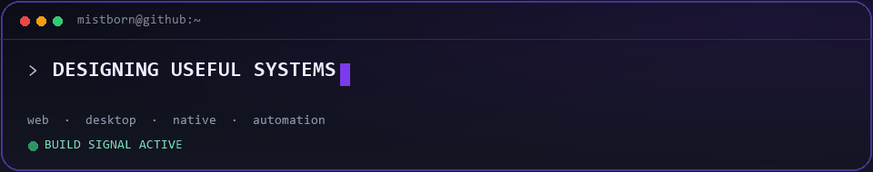
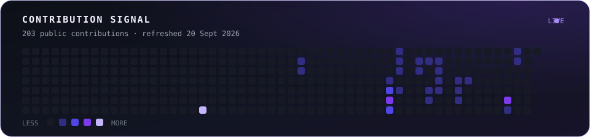

  

<h1 align="center">Building useful software with imagination and precision.</h1>

  Product-minded software engineer working across web, desktop, native apps and intelligent automation.
   
  I turn untidy real-world problems into focused tools that feel considered from the inside out.

  
  
  

---

### What I bring to the build

<table>
  <tr>
    <td width="50%" valign="top">
      <h3>◈ Product engineering</h3>
      
From a rough idea to a dependable product: interaction design, architecture, implementation and the unglamorous details that make software hold together.

    </td>
    <td width="50%" valign="top">
      <h3>◇ Desktop & native</h3>
      
Cross-platform desktop tools and native experiences built around real workflows—not technology demonstrations looking for a problem.

    </td>
  </tr>
  <tr>
    <td width="50%" valign="top">
      <h3>⌁ Automation</h3>
      
Practical systems that remove repetition, connect fragmented processes and give people their attention back.

    </td>
    <td width="50%" valign="top">
      <h3>✦ Design-minded delivery</h3>
      
Clear interfaces, thoughtful motion and strong information hierarchy—backed by maintainable code and sensible operational choices.

    </td>
  </tr>
</table>

### Current signal

  

### Technical orbit

  

  
  
  
  
  
  

### Contribution signal

  

Public activity generated from the GitHub GraphQL API and refreshed automatically by GitHub Actions. Private repositories stay private.

---

  
<strong>What I am exploring now</strong>

   
  <ul>
    <li>Tools that turn complicated personal workflows into calm, focused experiences.</li>
    <li>Desktop and native software where local capability genuinely improves the product.</li>
    <li>Automation that supports creative work without flattening the human part of it.</li>
    <li>Interfaces with enough personality to be memorable and enough restraint to stay useful.</li>
  </ul>

 

  <strong>Curious by default. Deliberate in execution. Always building.</strong>
   
  This profile is the public layer of a body of work that has largely lived in private repositories. Public case studies and reusable tools will appear here as they are ready.

